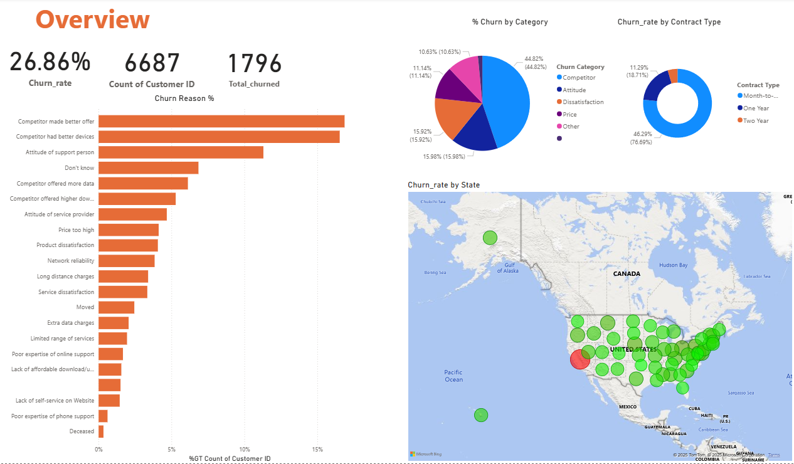
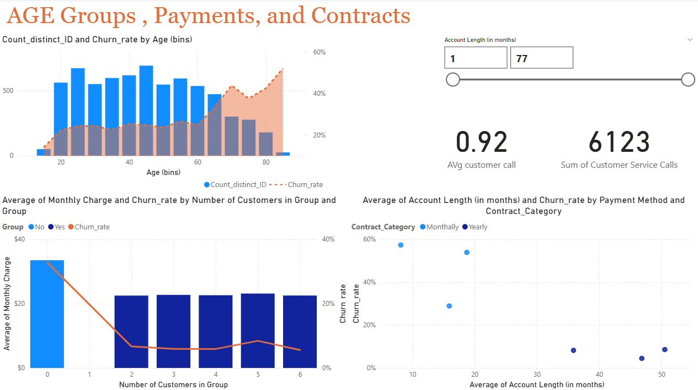

# 📉 Churn360 Insights: Telecom Customer Retention Dashboard

A dynamic Power BI dashboard designed to uncover churn patterns in a telecom company—focusing on customer demographics, contract types, payment methods, international usage, and service interactions.

---

## 🎯 Short Description / Purpose

The Churn360 Insights Dashboard is a comprehensive Power BI report built to analyze customer churn behavior for a subscription-based telecom provider. It helps stakeholders identify key drivers of churn and supports strategic decisions to improve customer retention. This tool is ideal for business analysts, data scientists, and customer success teams aiming to reduce churn and optimize service delivery.

---

## 📚 Data Dictionary

This section provides detailed metadata for the dataset used in the Churn360 Insights dashboard. It covers customer status, demographics, contract details, and subscription charges.

---

### 🧾 Customer Status

| Column Name     | Description |
|-----------------|-------------|
| `Customer ID`   | Unique identifier for each customer |
| `Churn Label`   | Indicates if the customer churned (`Yes` or `No`) |
| `Churn Reason`  | Specific reason for customer churn |
| `Churn Category`| Grouped churn reasons for broader analysis |

---

### 👥 Demographics

| Column Name     | Description |
|-----------------|-------------|
| `Under 30`      | Indicates if the customer is under 30 (`Yes` or `No`) |
| `Senior`        | Indicates if the customer is 65 or above (`Yes` or `No`) |
| `Age`           | Age of the customer |
| `Gender`        | Gender of the customer (`Male`, `Female`, or `Prefer not to say`) |
| `Group`         | Indicates if the customer is part of a group contract (`Yes` or `No`) |

---

### 📄 Contract Information

| Column Name             | Description |
|-------------------------|-------------|
| `Number of customers in a group` | Number of customers in the group contract |
| `Phone Number`          | Customer's phone number |
| `State`                 | State code where the customer resides |
| `Payment Method`        | Preferred payment method (`Credit Card`, `Direct Debit`, `Paper Check`) |
| `Contract Type`         | Type of contract (`Month-to-Month`, `One Year`, `Two Year`) |

---

### 💰 Subscription Types & Charges

| Column Name             | Description |
|-------------------------|-------------|
| `Account Length (in months)` | Duration of customer relationship with Databel |
| `Local Calls`           | Number of local (US-based) calls made |
| `Intl Calls`            | Number of international calls made |
| `Intl Mins`             | Minutes spent on international calls |
| `Intl Active`           | Indicates if international calling was used (`Yes` or `No`) |
| `Intl Plan`             | Indicates if customer had a premium international plan (`Yes` or `No`) |
| `Extra International Charges` | Charges for international calls without a premium plan |
| `Customer Service Calls`| Number of calls made to customer service |
| `Avg Monthly GB Download` | Average monthly data usage in GB |
| `Unlimited Data Plan`   | Indicates if customer had unlimited data (`Yes` or `No`) |
| `Extra Data Charges`    | Charges for data usage beyond plan limits |
| `Monthly Charges`       | Average monthly charges billed to the customer |
| `Total Charges`         | Sum of all charges over the customer’s lifetime |

---

This dictionary to understand the structure and semantics of the dataset powering the dashboard. It also helps in feature engineering, filtering, and interpreting visual insights.

## 🛠️ Tech Stack

The dashboard was developed using the following tools and technologies:

- 📊 **Power BI Desktop** – Core platform for building interactive visualizations and reports.
- 📂 **Power Query Editor** – Used for data cleaning, transformation, and shaping.
- 🧠 **DAX (Data Analysis Expressions)** – Created calculated columns and measures for churn metrics and dynamic filtering.
- 🧱 **Data Modeling** – Relationships built across customer, contract, service, and churn tables to enable cross-filtering and aggregation.
- 📁 **File Format** – `.pbix` for development and `.png` for dashboard previews.

---

## 🗃️ Data Source

The dataset simulates customer data from a fictional telecom company named **Databel**, including:

- Customer demographics (gender, senior citizen status, tenure)
- Subscription details (contract type, payment method, internet service)
- Usage metrics (international plan, customer service calls)
- Churn labels (whether the customer left or stayed)

Structured across multiple tables with metadata for column descriptions and business context.

---

## 📊 Exploratory Data Analysis (EDA)

Before building the dashboard, a comprehensive EDA was conducted to understand the dataset, clean and transform the data, and engineer meaningful features for churn analysis.

---

### 🔍 Key Steps in EDA

#### 🧼 Data Cleaning & Preparation

- **Missing Value Handling**:  
  Checked for nulls and inconsistencies across all columns to ensure data integrity.

- **Data Type Conversion**:  
  - Converted monetary columns (`Monthly Charges`, `Total Charges`, `Extra International/Data Charges`) from whole numbers to currency format for better readability.
  - Transformed abbreviated `State` codes into full **State + Province** names to support geographic segmentation.

---

#### 📊 Categorical & Numerical Analysis

- **Categorical Exploration**:  
  - Analyzed churn distribution across contract types, payment methods, and age groups.
  - Performed frequency analysis of churn reasons and grouped churn categories.

- **Numerical Exploration**:  
  - Assessed correlation between tenure, service usage, and churn likelihood.
  - Detected outliers in charges and customer service interactions.

---

### 🧠 Feature Engineering & Segmentation

To enhance the dashboard’s analytical depth, several calculated columns and buckets were created:

#### 📆 Tenure Buckets

| Bucket Name     | Tenure Range (Months) |
|-----------------|------------------------|
| New             | 0–12                   |
| Mid-Term        | 13–24                  |
| Long-Term       | 25+                    |

These buckets help identify churn patterns based on customer lifecycle stage.

#### 🧍 Age Buckets

| Segment Name   | Age Range     |
|----------------|---------------|
| Youth          | Under 30      |
| Adult          | 30–49         |
| Middle-Aged    | 50–64         |
| Senior         | 65 and above  |

Useful for demographic targeting and understanding churn across life stages.

#### 📶 Monthly Data Usage Buckets

| Usage Category     | Avg Monthly GB Download |
|--------------------|--------------------------|
| Low Usage          | Less than 5 GB           |
| Moderate Usage     | 5–15 GB                  |
| High Usage         | 15–30 GB                 |
| Heavy Usage        | More than 30 GB          |

Buckets were created separately for:
- Customers with **Unlimited Data Plans**
- Customers with **Limited Data Plans**

This segmentation reveals how data consumption and plan type influence churn behavior.

#### 📅 Contract Duration Consolidation

| Contract Group | Original Types Included     |
|----------------|-----------------------------|
| Monthly        | Month-to-Month              |
| Yearly         | One Year, Two Year          |

This consolidation simplifies churn comparison between short-term and long-term subscribers.

---

### 📈 Analytical Impact

These engineered features enable:

- Churn heatmaps by **Age Group**, **Contract Type**, and **Data Usage**
- Comparative churn analysis between **Unlimited vs. Limited** data users
- Strategic insights into which customer segments require focused retention efforts
- Enhanced filtering and storytelling in the Power BI dashboard

---

## ✨ Features / Highlights

### • Business Problem

Customer churn poses a major challenge for telecom companies, impacting revenue and growth. Understanding why customers leave is critical for designing retention strategies.

Key questions addressed:
- Which customer segments are most likely to churn?
- How do contract types and payment methods influence churn?
- Does international usage or customer service interaction correlate with churn?

---

### • Goal of the Dashboard

To deliver an interactive, data-driven dashboard that:
- Identifies churn-prone customer segments.
- Supports targeted retention campaigns.
- Enables business teams to explore churn patterns across multiple dimensions.

---

### • Walkthrough of Key Visuals

- 🔢 **Churn KPIs (Top Panel)**
  - Total Customers
  - Churn Rate (%)
  - Active vs. Churned Customers
  - Tenure Distribution

- 🧍‍♂️ **Demographic Breakdown (Pie & Bar Charts)**
  - Churn by Gender
  - Churn by Senior Citizen Status
  - Churn by Tenure Buckets

- 📄 **Contract & Payment Analysis**
  - Churn Rate by Contract Type (Month-to-Month, One-Year, Two-Year)
  - Churn by Payment Method (Electronic Check, Mailed Check, Bank Transfer)

- 🌐 **Service Usage & Support**
  - Impact of International Plan on Churn
  - Number of Customer Service Calls vs. Churn Likelihood

- 📊 **Interactive Filters**
  - Slicers for Contract Type, Payment Method, Internet Service, and Tenure Range
  - Dynamic visuals update based on user selections

---

### • Business Impact & Insights

- 🔍 **Retention Strategy**: Month-to-month contract holders show higher churn—suggesting need for loyalty incentives.
- 💳 **Payment Optimization**: Customers using electronic checks churn more—indicating potential friction in payment experience.
- 📞 **Support Intervention**: High churn among customers with frequent service calls—highlighting service quality issues.
- 📈 **Segment Targeting**: Senior citizens and long-tenure customers show lower churn—ideal for upselling and retention campaigns.

---

## 🖼️ Screenshots / Demos

| 📊 Dashboard Preview | 📈 Visual Highlights |
|----------------------|----------------------|
|  |  |

---

## 📬 Contact

For questions, feedback, or collaboration opportunities, feel free to reach out via [LinkedIn]([https://www.linkedin.com/in/arvind207kumar/](https://www.linkedin.com/in/arvind-kumar-560885231/)) or open an issue in this repository.

---

